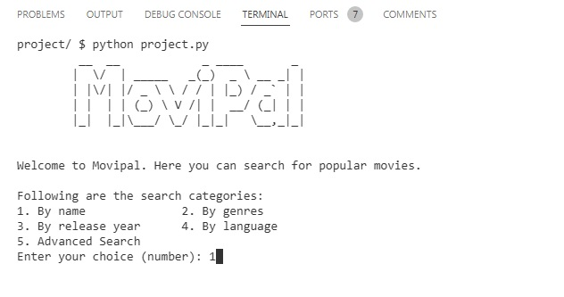
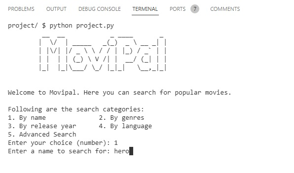
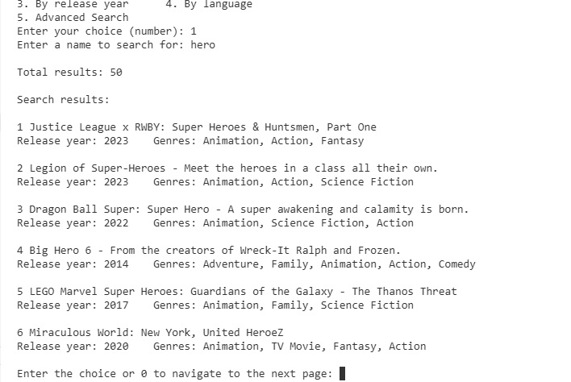
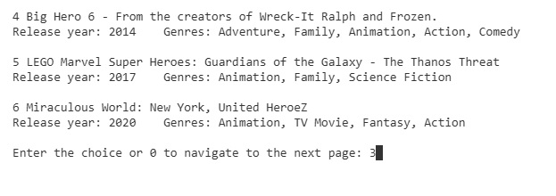

# MoviPal

#### Video Demo: [https://youtu.be/24AqUf9qP1M](https://youtu.be/24AqUf9qP1M)

#### Description:

This is a simple Python application which suggests movies based on user searches from a dataset containing 10,000 popular movies from [The Movie Database](https://www.themoviedb.org). The dataset has been downloaded from [here](https://www.kaggle.com/datasets/ursmaheshj/top-10000-popular-movies-tmdb-05-2023).

The application uses `pandas` to clean the dataset and search through it for the movies.

#### Libraries used:

- numpy : a requirement for pandas.
- pandas : to clean and process the dataset, and also to search.
- pyfiglet : to dislay the application's title when it starts.
- webbrowser : to open movie's page on TMDB's website.
- datetime : to do some processing.
- pytest : for testing the `project.py` file.

Out of the above libraries, `numpy`, `pandas`, `pyfiglet` and `pytest` need to be installed via pip, and are listed in the `requirements.txt` file. The `pytest` library isn't required by the main project file, but is needed for testing purposes and is utilised in the `test_project.py` file.

#### Files:

- `project.py` : main project file. Contains all code relevant for the project.
- `test_project.py` : test file. Contains all code to rest the `project.py` file.
- `requirements.txt` : contains the names of all pip installable libraries needed for the project.
- `popular_10000_movies_tmdb.csv` : the dataset file. Contains information about 10,000 popular movies from The Movie Database, downloaded from Kaggle.
- `README.md` : (this file) contains instructions for usage and also the deatils of the project.
- `readme_pics\` : contains images which are used in the `README.md` file.

#### Usage Guide

**Step 1 -** The starting view of the application is like the following:

The user gets to enter the  number of the choice they want to select. They can select any of the four search categories. The fifth search category (Advanced Search) is just the mixture of all the four categories, to present even more specific search results.

**Step 2 -** The user now has to enter the information, based on which, they want suggestions. The suggestions are presented based on a popularity score which has been calculated by TMDB using different metrics.

The user will be presented with the search results. A maximum of 6 results are presented at a time to the user. They can choose to go to the next page or select one of the search results.

**Step 3 -** The user now has to select one of the search results.

**Step 4 -** The user will be presented with the information about the movie they have selected. They are also prompted with an option to view the movie's page on TMDB's website.

The user is later asked if they want to end the application or search again.

#### How does the application work?

The application uses the `pandas` library to read and perform operations on the dataset, which is stored as a csv file. The file requires some processing, which is done as soon as it loads.

Functions with the names `fetch_by_(title/genre/year/lang)` are used to retrieve results from the dataset based on movie's title, genres, release year and original language respectively. They return information as a pandas dataframe.

Functions with the names `search_by_(name/genre/year/lang)` prompt user for search query, and then fetch information using the `fetch_by_(...)` functions. Then they utilise the `frame_presenter` function to print the results in a nice manner.

The `adv_search` function is the mixture of all other search methods. When using it, the user can enter more information to get more specific results.

#### Author: Saurabh Suman